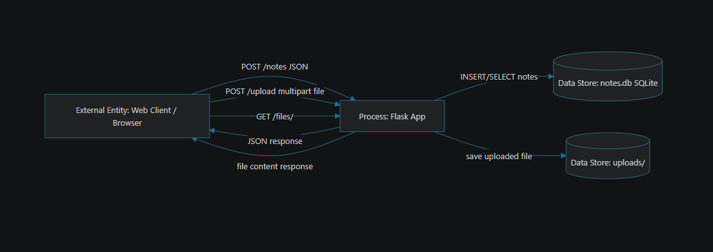
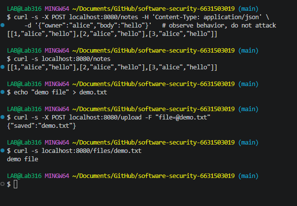

# Threat Model — <app name>

## 1. Data-flow diagram

## 2. Elements & trust boundaries
| Element | Type (process/store/entity/flow) | Trust boundary crossed? |
|---|---|---|
| Web client | external entity | yes (Internet → app) |
| Flask app | process | |
| SQLite DB (`notes.db`) | data store | |
| `uploads/` store | data store | |

## 3. STRIDE analysis
| Element | S | T | R | I | D | E |
|---|---|---|---|---|---|---|
| /notes | | | | | | |
| /upload | | | | | | |
| /files/<name> | | | | | | |

## 4. Top 5 risks (likelihood × impact) + mitigation
1.
2.
3.
4.
5.
