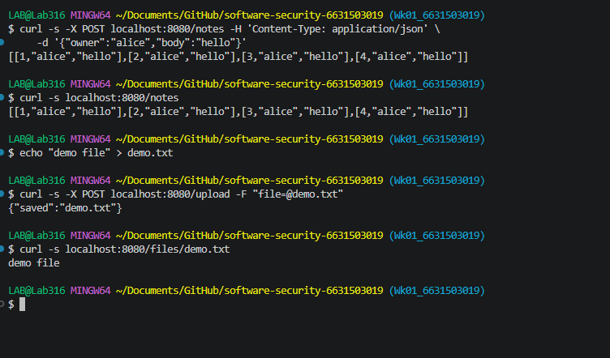
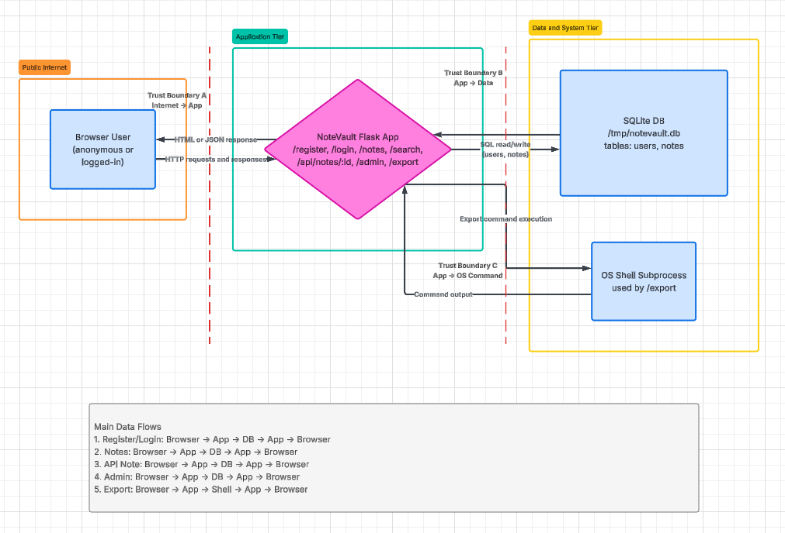
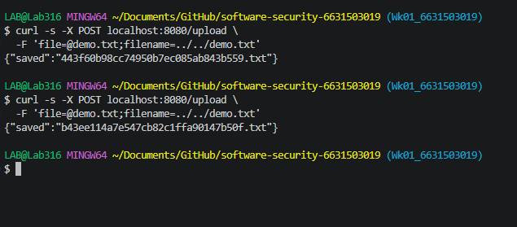
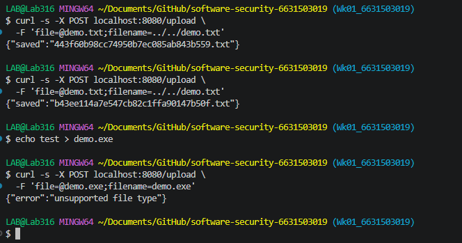

# Worksheet 1 — Security Mindset & Threat Modeling (3 hrs)

> **Course:** Software Security (KOSEN69) · **Week 1**
> **Aligned to:** OWASP 2025 A06 Insecure Design · CWE-501 (Trust Boundary Violation)
> **Signature game:** "Elevation of Privilege" (Microsoft STRIDE card deck)

> **Ethics note:** This week is *modeling only* — you analyze design, you do **not** attack the app. Run the sample app only on your own VM/localhost. Never apply these techniques to systems you do not own or lack written permission to test.

## Part 1 — Student Information
| Name | Student ID | Date | Group |
|---|---|---|---|
| Thiwakorn Boayairuksa| 6631503019 | 15/8/2569 | |

## Part 2 — Lecture Questions
Answer in your own words (2–4 sentences each).
1. The CIA triad consists of Confidentiality, Integrity, and Availability. Confidentiality fails when an attacker steals private customer data, integrity fails when an attacker changes a bank transaction, and availability fails when a DDoS attack makes a website inaccessible.
2. Trust boundary: where data crosses between components of different privilege. Data crossing this boundary needs extra scrutiny because it may be untrusted or malicious and should be validated before being processed.
3. Attack surface: every input an attacker can reach.having more API endpoints and using more third-party libraries/plugins can increase the attack surface.
4. STRIDE stands for Spoofing, Tampering, Repudiation, Information Disclosure, Denial of Service, and Elevation of Privilege. They correspond mainly to authentication, integrity, non-repudiation/accountability, confidentiality, availability, and authorization, respectively.
5. Secure by Design, as promoted by CISA, means building security into a product from the beginning and making secure settings the default. This differs from bolting security on after release, where developers build the product first and try to fix security problems later.

## Part 3 — Hands-on Lab (180 min)
**Learning goals:** build a data-flow diagram (DFD), apply STRIDE to a real Flask app, rank risks, and propose mitigations.
**Prerequisites:** Docker + Docker Compose in your VM; a drawing tool (draw.io / paper + photo); the Elevation of Privilege deck (print or virtual) — free print-and-play PDF at [github.com/adamshostack/eop](https://github.com/adamshostack/eop).

**Environment setup**
```bash
cd labs/week01-threat-modeling
docker compose up --build           # starts sample-app on http://localhost:8080
curl -s -X POST localhost:8080/notes -H 'Content-Type: application/json' \
     -d '{"owner":"alice","body":"hello"}'   # observe behavior, do not attack
curl -s localhost:8080/notes

echo "demo file" > demo.txt
curl -s -X POST localhost:8080/upload -F "file=@demo.txt"   # observe behavior, do not attack
curl -s localhost:8080/files/demo.txt
```

Source to model lives in `sample-app/app.py`. Template to fill: `THREAT-MODEL-TEMPLATE.md` (copy it, do not edit the original).

**What to submit per task:** the threat/element identified + a screenshot (DFD, table, or running app) + a 2–3 sentence mitigation.

**Task 0 — Onboarding (5 min)** · *Goal:* prove the environment works. *Steps:* `docker compose up`, hit `/notes` and `/files/<name>`, read `sample-app/app.py`. *Deliverable:* screenshot of the running app + the JSON response.

**Task 1 — Draw the DFD (25 min)** · *Goal:* map the system. *Steps:* identify the external entity (web client), the process (Flask app), the data store (`notes.db` SQLite), the `uploads/` store, and the flows for `/notes`, `/upload`, `/files/<name>`; mark the Internet→app trust boundary with a dashed line. *Deliverable:* DFD image embedded in your copy of the template.

**Task 2 — STRIDE the elements (30 min)** · *Goal:* enumerate threats per element. *Steps:* for each element fill the S/T/R/I/D/E grid. Ground it in real code: `/notes` accepts a client-supplied `owner` with no auth (Spoofing); `/upload` saves raw `f.filename` — arbitrary-file-write (Tampering) — and echoes the resolved save path back in its response (Information disclosure); `/files/<name>` reads it back but is comparatively defended (see Task 5); no logging anywhere (Repudiation). *Deliverable:* completed STRIDE table.
| Element       | S | T | R | I | D | E |
|---------------|---|---|---|---|---|---|
| /notes        | Client can spoof owner; no auth | Client can alter note data | No logging | Unauthorized notes may be exposed | Repeated requests may consume DB resources | Attacker can act as another owner |
| /upload       | No authenticated uploader | Raw f.filename enables arbitrary-file-write | No upload logging | Resolved save path is disclosed | Large/repeated uploads can exhaust disk | Unsafe file write may cross intended boundaries |
| /files/<name> | Caller can request guessed names | Path manipulation may target unintended files | No access logging | File contents may be disclosed | Repeated requests may degrade service | Bypass of path controls could expand file access |
**Task 3 — Elevation of Privilege game (20 min)** · *Goal:* find threats you missed. *Steps:* play the EoP deck against your DFD; each card you can tie to a real element/flow scores a point; record every valid threat. No printer or scissors? Draw from the digital deck below instead — same 78 cards, same rule. *Deliverable:* list of carded threats + score.
Threat or element identified — carded threats:
Identity spoofing through the client-controlled owner field on /notes.
Tampering through the user-controlled filename on /upload.
Information disclosure through file retrieval on /files/<name>.
Repudiation risk caused by the absence of actionable audit logs.
DoS risk through repeated note insertion or file uploads.

Score:
Valid card-to-flow mappings: 5
Total score: 5
```sim
eop-deck
```

**Task 3b — Systems-level pass (25 min) 🔭** · *Goal:* find what the per-element grid cannot see. Tasks 2 and 3 enumerate threats **one element at a time**, and that is exactly where threat models are known to stop short — students taught STRIDE alone reliably identify component threats and *discount system-level ones* ([Joshi et al., ASEE 2024](https://arxiv.org/abs/2404.16632)). So do a second pass over the **whole** diagram:


- **Trust boundaries end-to-end.** Follow one request from the client to `notes.db` and back. List every boundary it crosses. Which crossing has no check on it?
- **Assume one element is fully owned.** Pick the Flask process, then the `uploads/` store. For each: what does the attacker now *reach* — not what is it, but where does it get them?
- **Chain two "low" findings.** Find two threats you or the EoP deck rated minor that combine into something you would not accept. Write the chain as `A → B → consequence`.
- **One-line system claim.** Finish: "Even if every element-level mitigation in Task 8 is implemented, this system still fails if ___."

Use the simulation below before you start — toggle a component to attacker-controlled and watch what it reaches:

```sim
trust-boundary
```

*Deliverable:* the boundary list, two owned-element reachability notes, one written chain, and the system claim.
1. Trust-boundary list
Request path:
Web Client → Internet/Application Boundary → Flask App → Application/Data Boundary → notes.db
Response path:
notes.db → Application/Data Boundary → Flask App → Internet/Application Boundary → Web Client

The most important unchecked crossing is the client-to-application boundary because
the application trusts client-supplied identity information such as the "owner" field
without authentication.

2. Owned-element reachability
Flask process fully owned:
If the Flask process is compromised, the attacker can reach the application's
database access and file-handling capabilities. This potentially gives access to
notes.db and the uploads/ storage and allows the attacker to act through the
application's existing privileges.

uploads/ store fully owned:
If the uploads store is compromised, the attacker can affect files that the
application later serves through /files/<name>. The impact therefore crosses
from the storage layer back into the application/client-facing file retrieval flow.

3. Low-finding chain
Client-controlled owner → unauthorized note access → attacker reads or acts on
another user's notes.

4. System claim
Even if every element-level mitigation in Task 8 is implemented, this system
still fails if trust-boundary checks are not enforced consistently across the
complete client → application → data flow.
**Task 4 — Abuse cases & attacker personas (20 min)** · *Goal:* think like specific adversaries. *Steps:* define 2 personas (e.g. a curious logged-in user; an anonymous internet attacker) and write 2 abuse cases each against the sample app, tied to DFD elements. *Deliverable:* 4 abuse cases.
Persona 1: Curious logged-in user
Abuse Case 1:
The user changes the owner value in a /notes request to another username and
attempts to access notes belonging to that owner.
DFD elements: Web Client → Flask App → notes.db
Abuse Case 2:
The user uploads a file with a manipulated filename and attempts to influence
where the application stores the file.
DFD elements: Web Client → /upload → Flask App → uploads/

Persona 2: Anonymous internet attacker
Abuse Case 3:
The attacker submits repeated or oversized requests to /notes or /upload in
order to consume database, CPU, or disk resources.
DFD elements: Internet → Flask App → notes.db / uploads/
Abuse Case 4:
The attacker guesses an uploaded filename and requests it through
/files/<name> to obtain file contents that should not be exposed.
DFD elements: Web Client → /files/<name> → uploads/

**Task 5 — Path-traversal deep-dive (25 min)** · *Goal:* analyze the riskiest flow. *Steps:* trace `/upload` → `/files/<name>`; explain how `../` in a filename escapes `uploads/`; sketch the secure design (`secure_filename`, store outside web root, allow-list extensions). *Deliverable:* the data flow + secure-design note.
Data flow:
Client
  ↓
/upload
  ↓
Flask App
  ↓
filename supplied by client
  ↓
uploads/
  ↓
/files/<name>
  ↓
Client

Risk:
If the application constructs a filesystem path using an untrusted filename,
a filename containing "../" can refer to a parent directory instead of remaining
inside uploads/. This can cause the application to write or access a file outside
the intended upload directory.

Secure design:
1. Use secure_filename() to remove unsafe path components and normalize filenames.
2. Store uploaded files outside the web root.
3. Allow only explicitly approved file extensions and content types.
4. Generate server-side filenames instead of trusting the client filename.
5. Verify that the final resolved path remains inside the intended upload directory.

The security goal is that no user-supplied string can escape the intended storage
directory or become an unintended filesystem path component.

**Task 6 — Threat-model the project target (30 min)** · *Goal:* kick off your term project. *Steps:* stop the sample-app first (`docker compose down` — both apps bind host port 8080), then run **NoteVault** (`cd ../../project/starter-app && docker compose up`), draw a quick DFD, and list the top 3 STRIDE threats you'd investigate. *Deliverable:* NoteVault DFD + top-3 threats (reuse these in your project report — `project/REPORT-TEMPLATE.md` in the repo root).

1. Command Injection / Unsafe Command Execution
   STRIDE: Tampering / Elevation of Privilege
   Element: NoteVault Flask App → OS Shell Subprocess (/export)
   Risk: User-controlled input reaching the export command could allow
   unintended OS command execution.

2. Unauthorized Access to Notes
   STRIDE: Spoofing / Elevation of Privilege
   Element: Browser → Flask App → SQLite DB
   Risk: Weak authentication or authorization could allow one user to
   access or modify another user's notes.

3. SQL Injection / Database Tampering
   STRIDE: Tampering / Information Disclosure
   Element: Flask App → SQLite DB
   Risk: Unsafe construction of SQL queries using user-controlled input
   could allow unauthorized database reads or modifications.

**Task 7 — Security requirements (15 min)** · *Goal:* turn threats into testable requirements. *Steps:* write 3 security requirements as acceptance criteria ("the system must … so that …"), each mapped to a threat from Task 2 or Task 6. *Deliverable:* 3 testable security requirements.
Requirement 1 — Authentication and Authorization
The system must authenticate users and authorize note access based on the
authenticated user's identity so that a client cannot access or modify
another user's notes by changing a request parameter.

Mapped threat:
Task 2 — /notes Spoofing / Elevation of Privilege


Requirement 2 — Safe File Handling
The system must reject unsafe filenames and ensure that every uploaded file
is stored within the designated upload directory so that user-controlled
input cannot cause arbitrary file writes.

Mapped threat:
Task 2 — /upload Tampering


Requirement 3 — Security Logging
The system must record security-relevant note, upload, and file-access events
with sufficient information to identify the action and time so that malicious
activity can be investigated and attributed.

Mapped threat:
Task 2 — Repudiation
**Task 8 — Defend / fix it: rank & mitigate (25 min) 🛡️** · *Goal:* turn threats into action you can prove. *Steps:* rank the top 5 threats by likelihood × impact; propose one concrete mitigation each (e.g., auth on `/notes`, `secure_filename()` + allowlist for `/upload`, request logging for Repudiation, size/rate limits for DoS). Then **pick one and actually implement it** in your fork.

*Deliverable — the top-5 table, plus for the one you implemented:*
# Rank | Threat                                      | L | I | Score
# -----|---------------------------------------------|---|---|------
#  1   | Path traversal / arbitrary file write       | 5 | 5 | 25
#      | Mitigation: Do not use user filename as path component.
#      | Generate server-side filename + allow-list extensions.
#
#  2   | Spoofing owner in /notes (no authentication)| 4 | 4 | 16
#      | Mitigation: Require authentication and derive owner
#      | from the session only.
#
#  3   | Information disclosure from /files/<name>   | 4 | 3 | 12
#      | Mitigation: Serve only files belonging to the owner
#      | and use opaque file IDs instead of predictable names.
#
#  4   | Repudiation (no security logging)           | 3 | 3 |  9
#      | Mitigation: Add structured audit logs:
#      | user, action, resource, timestamp, result.
#
#  5   | DoS from repeated uploads/requests          | 3 | 3 |  9
#      | Mitigation: Limit file size, rate-limit requests,
#      | and configure request timeouts.
#
# ============================================================
# Task 8 — Selected Mitigation:
# Fix /upload to prevent path traversal and arbitrary file write.
# ============================================================
1. 6a6c30f (HEAD -> Wk01_6631503019) Fix upload path traversal
2. 
3. This is a class fix, not an instance fix. The server never uses the user-supplied filename as a filesystem path component; instead, it validates the file extension and generates a server-side UUID filename. Therefore, path traversal is prevented by the design of the upload flow rather than by blocking individual traversal strings.

> **Why this is weighted.** Fewer than half of working developers can spot a security hole in code, and being shown vulnerabilities does not by itself teach you to find or close them. Exploiting is the half that feels like progress; defending is the half that transfers to your job.

## Part 4 — Reflection
1. CWE-862 (Missing Authorization) and OWASP A06: Insecure Design because failing to properly design and enforce authorization can allow users to access actions or data they should not be permitted to access.
2. Capital One breach (2019) involved an attacker accessing sensitive data through a misconfigured cloud firewall and exploiting excessive permissions. A stronger least-privilege access design combined with proper authorization and cloud configuration controls could have prevented or significantly limited the breach.
3. implementing strong authorization and least-privilege controls It directly prevents unauthorized access to sensitive functions and limits the damage if an account or component is compromised.

## Grading rubric (100)
| Criterion | Points |
|---|---|
| Lecture questions (Part 2) | 20 |
| Exploitation + evidence (DFD + STRIDE table + EoP findings + screenshots) | 40 |
| Defense (top-5 ranking + mitigations) | 25 |
| Reflection (CWE/OWASP mapping + breach + best mitigation) | 15 |

**Assessed within the rows above** (they are not extra points — they are what those points are for):
- **Systems-level reasoning** (inside *Exploitation + evidence*, Task 3b): does the model reach past single elements to boundaries, reachability and chains? Scored with the STRIDE + systems-thinking rubrics of [Joshi et al. 2024](https://arxiv.org/abs/2404.16632).
- **Defensive proof** (inside *Defense*, Task 8): a claimed mitigation with no before/after evidence scores at most half. A mitigation you can show closing a *class* scores full.
- **Adversarial thinking** (across the whole sheet): do the abuse cases, personas and chains show you reasoning as an attacker with goals and constraints — or just listing categories? This is the course's central disposition and it is assessed, not assumed.

---

## Evidence & Integrity (required)

- **Identity proof:** every screenshot/diagram must show a terminal running `printf '%s | %s | ' "$(whoami)" '<YOUR-STUDENT-ID>'; date '+%F %T %Z'` **in the
  same image as the evidence**. When the evidence is a browser page, a DevTools panel or a
  rendered response, put that terminal **beside the browser and capture the whole screen** — a
  cropped window carries nothing that identifies you, and the lab's own output is
  byte-identical for the whole cohort *by design*, so the stamp is the only thing that makes
  the shot yours. Generic or borrowed evidence is not accepted.
- **Personalized flag (if this lab issues one):** ____________________
  *Flags are unique per student — submitting another student's flag is a violation. How to submit: **learn.zcr.ai/submit** (full guide: `SUBMISSION.md` in the repo root).*
- **Explain in your own words** *(graded on your reasoning, not copied text):*
  1. What did you do, and **why did the vulnerability work**?
  2. **Why does your fix actually stop it** — and what could still break it?

---

## 🤖 Audit the AI (required)

AI is a power tool you must **distrust** — you are graded on your *critique*, not the AI's answer.

1. Ask an AI assistant to exploit **or** fix this week's vulnerability. Paste its full answer.
2. **Find what's wrong or risky** in it — insecure code, a subtly incomplete fix, a hallucinated API/function/CVE, a missed edge case, or wrong reasoning. Quote the exact line(s).
3. Produce the **correct, verified** version yourself and explain in 2–3 sentences why the AI's output was insufficient.

> Disclose your AI use in the Part 1 table. This task counts toward your **Defense + Reflection** score.

---

## 🧠 Comprehension & Prompt (required)

**A. Explain in Plain English (EiPE).** In 2–3 sentences, in your own words, describe what this week's vulnerable code/endpoint actually *does* and *why it is exploitable* — explain the mechanism, don't dump jargon.

**B. Prompt Problem.** Write a **single prompt** that makes an AI produce a *correct, secure* fix for one finding. Run it: does the exploit now fail? If not, refine the prompt and try again. Submit the **final prompt + the verified result**.
*Graded on the prompt's precision and your verification — this trains problem decomposition and AI literacy (Denny et al. 2024).*
