# Worksheet 2 — Secure SDLC & Tooling (3 hrs)

> **Course:** Software Security (KOSEN69) · **Week 2**
> **Aligned to:** OWASP 2025 (A05 Injection [CWE-89, CWE-78], A04 Cryptographic Failures [CWE-327], A02 Security Misconfiguration [CWE-798, CWE-489]) · CWE-798, CWE-89, CWE-78, CWE-327, CWE-489
> **Signature game:** "Bug Triage Race" (scan → triage; score = true positives − misclassified)

> **Ethics note:** The scanners run only against the provided `vulnerable-repo/` on your own machine. Do not point SAST/secret scanners at third-party repos or production systems without authorization. Treat any secret you find here as fake lab data.

## Part 1 — Student Information
| Name | Student ID | Date | Group |
|---|---|---|---|
| Thiwakorn Boayairuksa| 6631503019 | 15/8/2569 | |

## Part 2 — Lecture Questions
Answer in your own words (2–4 sentences each).
1. SAST checks source code for security problems without running the application, usually during development. DAST tests a running application from the outside, while SCA checks third-party dependencies for known vulnerabilities; these tools can be added at different stages of the SDLC and CI/CD pipeline.
2. Secret scanning searches code repositories for exposed credentials such as API keys, passwords, and access tokens. Hardcoded secrets often appear because developers add them directly to code for convenience, forget to remove them, or accidentally commit configuration files containing them.
3. Shift-left means moving security checks earlier in the SDLC instead of waiting until the application is finished. In a CI pipeline, tools such as SAST, SCA, and secret scanning can run automatically on commits or pull requests so developers can fix problems before deployment.
4. Coverage-guided fuzzing generates many different inputs and keeps inputs that reach new code paths. It is powerful because it can automatically explore a large number of execution paths and find crashes or unexpected behavior that normal testing may miss.
5. A true positive is a scanner finding that correctly identifies a real security problem, while a false positive reports a problem that is not actually present. Missing a true positive can leave a vulnerability exploitable, while wasting time on false positives can overwhelm developers and cause them to ignore important warnings.


## Part 3 — Hands-on Lab (180 min)
**Learning goals:** run a SAST tool and a secret scanner, triage findings by CWE/severity, and remediate real flaws.
**Prerequisites:** Docker installed; internet to pull the Semgrep/Gitleaks images.

**Environment setup**
```bash
cd labs/week02-sdlc-tooling
cat scan.sh                 # see exactly what it runs
bash scan.sh                # Semgrep (p/default + p/owasp-top-ten) then Gitleaks on ./vulnerable-repo
```
Target under scan: `vulnerable-repo/app.py` (plus `requirements.txt`). It contains five planted flaws.

**What to submit per task:** the command/payload run + a screenshot of the finding + a 2–3 sentence mitigation.

**Task 0 — Onboarding (5 min)** · *Goal:* confirm tooling. *Steps:* run `bash scan.sh`; confirm both Semgrep and Gitleaks sections produce output. *Deliverable:* screenshot showing both tools ran.
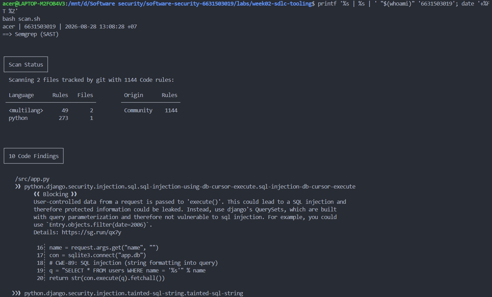
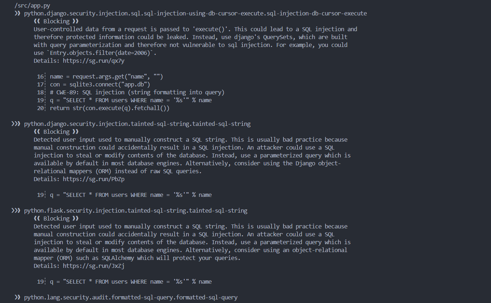
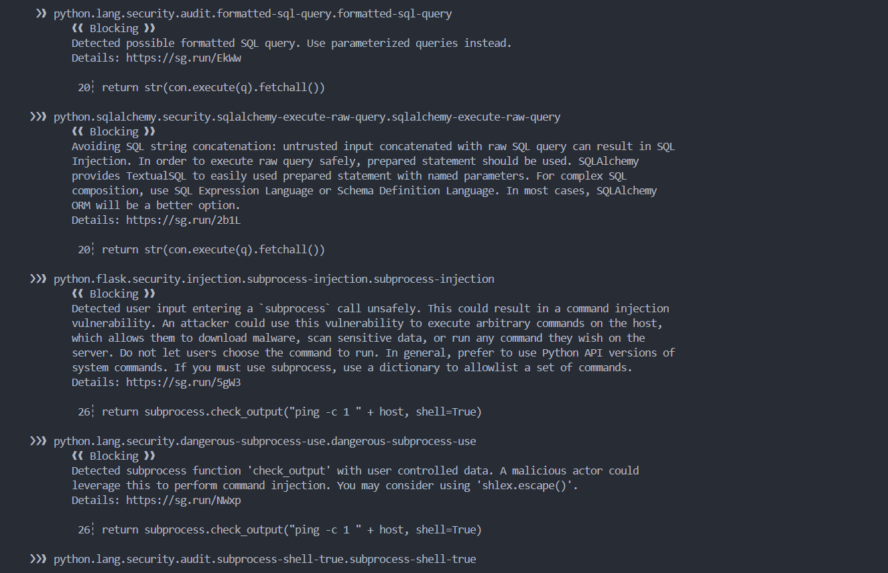
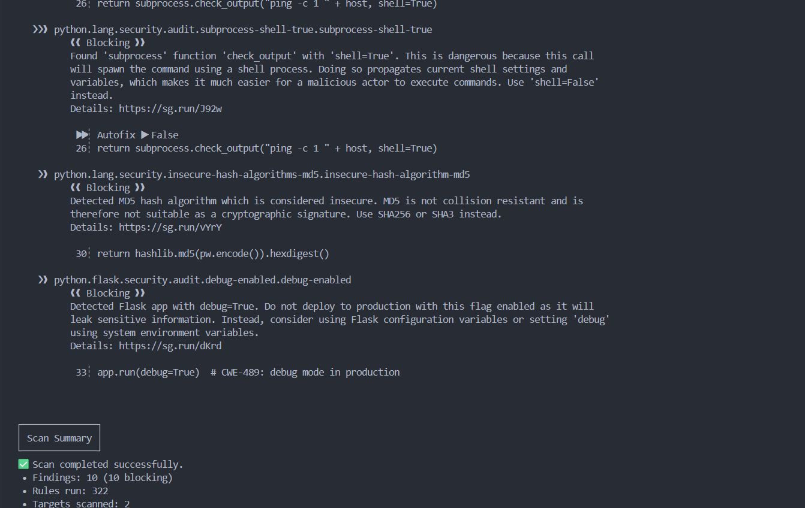
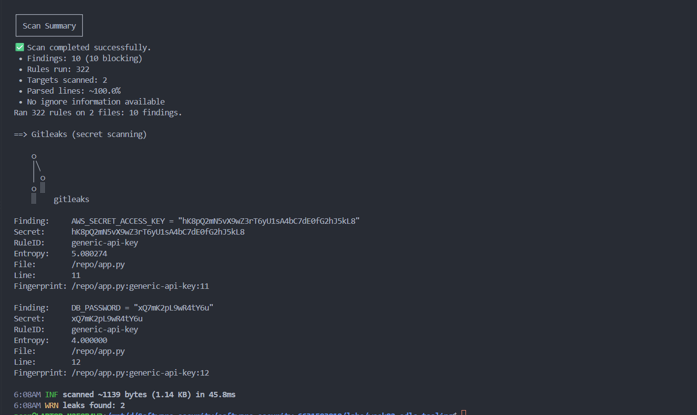//Semgrep and Gitleaks both ran successfully. Semgrep produced security findings from the vulnerable repository, and Gitleaks detected leaked secrets.
**Task 1 — SAST sweep with Semgrep (25 min)** · *Goal:* find code flaws. *Steps:* read the Semgrep output; locate the SQL injection in `/user` (CWE-89, string-formatted query), the OS command injection in `/ping` (CWE-78, `shell=True`), the weak `md5` password hash (CWE-327), and `debug=True` (CWE-489). *Deliverable:* one screenshot per finding with the file:line.
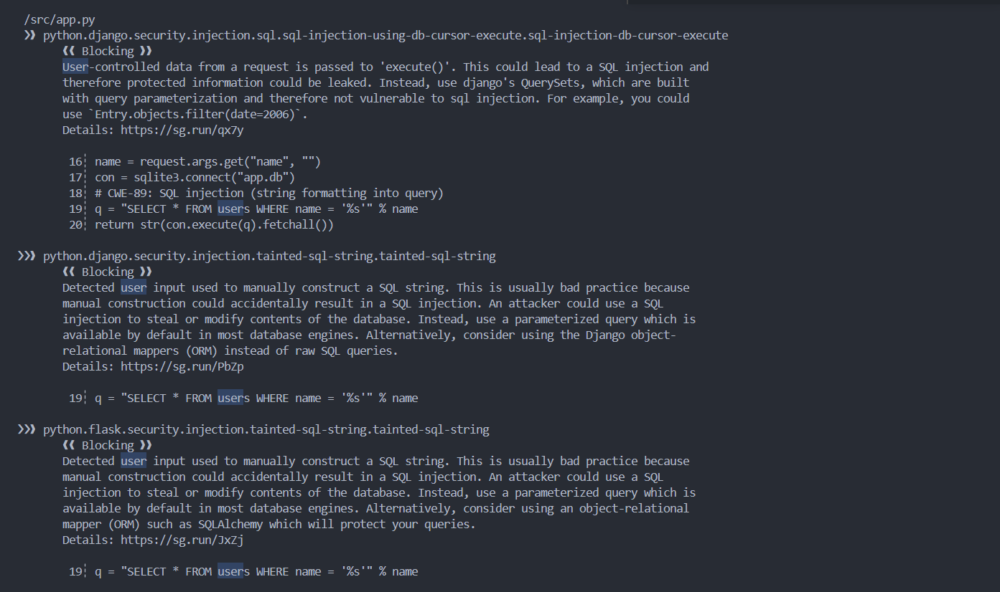//SQL Injection
The application should use a parameterized query and pass name as a separate parameter instead of directly concatenating user input into the SQL statement. This ensures that the input is treated as data rather than SQL syntax, which helps prevent SQL injection.
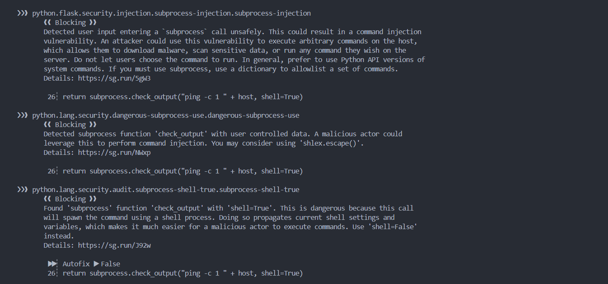//OS Command Injection
The application should avoid using shell=True and pass the command as an argument list, such as ["ping", "-c", "1", host]. The host value should also be validated using an appropriate allowlist or input validation to prevent user input from being interpreted as additional shell commands.
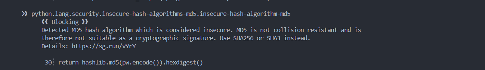//Weak Password Hash
The application should replace MD5 with a password-hashing algorithm such as Argon2id or bcrypt, which is designed to be slower and uses a unique salt for each password. This makes offline password guessing significantly more difficult if password hashes are stolen.
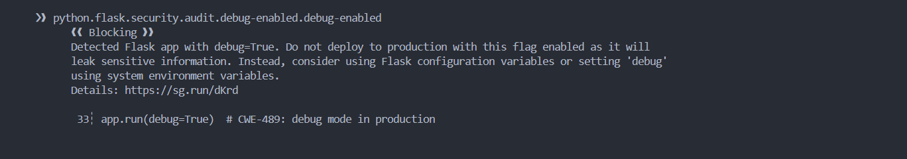//Debug Mode
The application should set debug=False in production and manage configuration through appropriate environment variables or configuration settings. Disabling debug mode helps prevent the application from exposing internal information and detailed error messages that could assist an attacker.

**Task 2 — Secret scan with Gitleaks (15 min)** · *Goal:* find leaked credentials. *Steps:* read the Gitleaks output; identify `AWS_SECRET_ACCESS_KEY` and `DB_PASSWORD` (CWE-798). *Deliverable:* screenshot + the rule that fired for each.
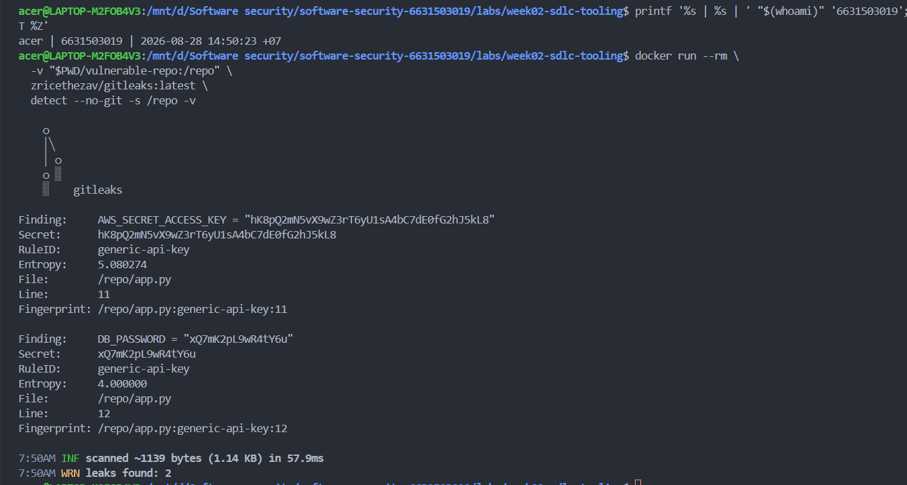 //Hardcoded Credentials
The AWS credentials and database password should not be stored directly in the source code. They should be moved to environment variables or a dedicated secrets manager, and if the credentials were real, they should be revoked and rotated immediately. This prevents anyone who obtains the source code from directly obtaining valid credentials.

**Task 3 — Bug Triage Race (30 min)** · *Goal:* triage accurately. *Steps:* build a table with columns *Tool | File:Line | CWE | Severity | TP/FP | Fix idea*; mark at least 3 true positives and 1 likely false positive and justify each. (Score = TP − misclassified.) *Deliverable:* the completed triage table.
| Tool                                   | File:Line   | CWE     | Severity | TP/FP         | Fix idea                                                                 | Justification                                                                                                                                  |
| -------------------------------------- | ----------- | ------- | -------- | ------------- | ------------------------------------------------------------------------ | ---------------------------------------------------------------------------------------------------------------------------------------------- |
| Semgrep (tainted-sql-string)           | `app.py:19` | CWE-89  | High     | **TP**        | เปลี่ยนเป็น parameterized query ด้วย `?` และ bind ค่าแยก                 | รับค่า `name` จากผู้ใช้แล้วนำไปประกอบ SQL โดยตรง จึงเสี่ยง SQL injection                                                                       |
| Semgrep (subprocess-shell-true)        | `app.py:26` | CWE-78  | High     | **TP**        | ตัด `shell=True` และส่งคำสั่งเป็น argument list พร้อม validate `host`    | ค่า `host` มาจากผู้ใช้และถูกต่อเข้าคำสั่ง shell โดยตรง                                                                                         |
| Gitleaks (generic-api-key)             | `app.py:11` | CWE-798 | High     | **TP**        | ย้าย secret ไป environment variables หรือ secret manager                 | พบ credential ที่ถูก hardcode ไว้ใน source code โดยตรง                                                                                         |
| Semgrep (sqlalchemy-execute-raw-query) | `app.py:20` | CWE-89  | Medium   | **Likely FP** | ไม่ต้องแก้เพิ่ม เพราะเป็น finding ที่ overlap กับ SQL injection เดียวกัน | Semgrep รายงานซ้ำจาก SQL query เดียวกับ finding ที่ `app.py:19`; จึงควร triage เป็น duplicate/overlap มากกว่าจะนับเป็น vulnerability แยกอีกตัว |

**Task 4 — Fuzzing intro (10 min)** · *Goal:* see coverage-guided fuzzing find a bug SAST won't. *Steps:* in the `labs/toolbox` container (Apple clang has no libFuzzer runtime), build `clang -g -fsanitize=address,fuzzer harness.c -o fuzz`, then **seed the corpus** and run it:
`mkdir -p corpus && printf 'FUZ' > corpus/seed && ./fuzz corpus`. It crashes almost immediately with an AddressSanitizer heap-buffer-overflow at `harness.c:23` (the `data[3]` read with no `size > 3` check). Seeding matters: an unseeded `./fuzz` has to rediscover the magic bytes by chance and often finds nothing for minutes — that unpredictability is itself worth a sentence in your write-up. (The deep fuzzing+exploit lab is Week 11.) *Deliverable:* the ASan crash output (or a screenshot) + a 2-sentence note on why fuzzing finds this bug when a linter/SAST pass over the same 4-line check would not.
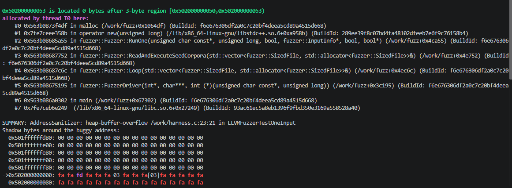 //Coverage-guided fuzzing found the heap-buffer-overflow because the seeded input `FUZ` reached the code path that accesses `data[3]` without checking whether the input is large enough. A linter or pattern-based SAST tool may miss this bug because detecting it requires reasoning about the runtime input size and the bounds of the memory access, rather than just recognizing an obviously unsafe coding pattern.

**Task 5 — Scan the project target (40 min)** · *Goal:* apply the tools to your term project. *Steps:* run Semgrep + Gitleaks against **NoteVault** (`../../project/starter-app`); also run an SCA scan: `docker run --rm -v "$PWD/../../project/starter-app:/src" aquasec/trivy fs /src`. *Deliverable:* a findings list (tool, file:line/CVE, CWE) — reuse it in your project vuln report.
| Tool     | File:Line / CVE    | CWE     | Severity        | Finding                                                  |
| -------- | ------------------ | ------- | --------------- | -------------------------------------------------------- |
| Semgrep  | `app.py:19–20`     | CWE-89  | Blocking/High   | SQL Injection — user input ถูกนำไปสร้าง SQL query โดยตรง |
| Semgrep  | `app.py:26`        | CWE-78  | Blocking/High   | OS Command Injection — ใช้ user input กับ `shell=True`   |
| Semgrep  | `app.py:30`        | CWE-327 | Blocking/High   | ใช้ MD5 สำหรับ password hashing                          |
| Semgrep  | `app.py:209`       | CWE-489 | Blocking/Medium | `debug=True`                                             |
| Semgrep  | `Dockerfile`       | —       | Blocking        | ไม่กำหนด `USER` ทำให้ container อาจทำงานเป็น root        |
| Gitleaks | —                  | —       | —               | **No leaks found**                                       |
| Trivy    | `requirements.txt` | —       | HIGH            | `CVE-2023-30861` — Flask 2.0.1                           |
| Trivy    | `requirements.txt` | —       | HIGH            | `CVE-2022-29217` — PyJWT 1.7.1                           |
| Trivy    | `requirements.txt` | —       | HIGH            | `CVE-2021-33503` — urllib3 1.26.4                        |
| Trivy    | `requirements.txt` | —       | MEDIUM          | `CVE-2024-22195` — Jinja2 3.0.1                          |

**Task 6 — Build a security CI gate (25 min)** · *Goal:* automate the scan (previews Week 15). *Steps:* adapt `../week15-devsecops-pipeline/security-ci.yml` into a workflow that runs Semgrep + Trivy + Gitleaks and **fails on HIGH/CRITICAL**; run it locally (`act`) or commit to your fork and read the Actions log. *Deliverable:* the workflow file + a screenshot of a failing run.
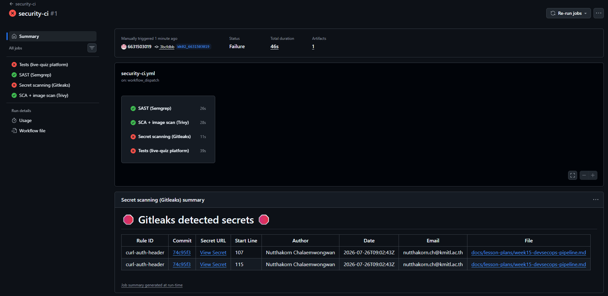
https://github.com/6631503019/software-security-6631503019/blob/3bcfdbb79a273159f8b037020fcb684a84686708/.github/workflows/security-ci.yml
**Task 7 — SAST blind spots (20 min)** · *Goal:* see what scanners miss. *Steps:* find one real bug in `vulnerable-repo/app.py` (or NoteVault) that Semgrep did **not** flag, and explain why a pattern-based tool missed it. *Deliverable:* the bug + a 2-sentence explanation.
app.py:11–12 contains hardcoded AWS and database credentials, which could be exposed if the source code is leaked or committed to a public repository. Semgrep missed this because pattern-based SAST may not reliably determine that arbitrary string values are real secrets, while a dedicated secret scanner such as Gitleaks is designed to detect credential-like patterns.
**Task 8 — Defend / fix it (10 min)** · *Goal:* remediate the planted flaws in `vulnerable-repo/app.py`. *Steps:* rewrite `/user` to use a parameterized query (`?` placeholder); remove `shell=True` and pass an argument list in `/ping`; move both secrets to environment variables; replace `md5` with bcrypt/argon2; set `debug=False`. *Deliverable:* a before/after diff for each fix mapped to its CWE.
| CWE     | ปัญหา                 | Before → After                          |
| ------- | --------------------- | --------------------------------------- |
| CWE-89  | SQL Injection         | String formatting → Parameterized query |
| CWE-78  | OS Command Injection  | `shell=True` → Argument list            |
| CWE-798 | Hardcoded Credentials | Source code → Environment variables     |
| CWE-327 | Weak Password Hash    | MD5 → bcrypt                            |
| CWE-489 | Debug Mode            | `debug=True` → `debug=False`            |

## Part 4 — Reflection
1. CWE-798 (Use of Hard-coded Credentials) → OWASP A07: Identification and Authentication Failures, because embedding credentials in source code can allow attackers to obtain and misuse valid authentication secrets.
CWE-89 (SQL Injection) → OWASP A05: Injection, because unsanitized user input can be interpreted as SQL commands and alter database queries.
2. The GitHub OAuth token leak at Uber in 2016 is an example of sensitive credentials being exposed and abused. Secret scanning combined with pre-commit/CI checks could have detected the credential before it was committed or deployed.
3. Secret scanning gave the highest-value findings because exposed credentials can provide an attacker with direct access to systems or data. It also produces highly actionable findings because a confirmed secret can be immediately revoked and replaced.

## Grading rubric (100)
| Criterion | Points |
|---|---|
| Lecture questions (Part 2) | 20 |
| Exploitation + evidence (scan output + triage table + screenshots) | 40 |
| Defense (remediated `app.py` with before/after diffs) | 25 |
| Reflection (CWE/OWASP mapping + breach + tool value) | 15 |

---

## Evidence & Integrity (required)

- **Identity proof:** every screenshot/diagram must show a terminal running `printf '%s | %s | ' "$(whoami)" '<YOUR-STUDENT-ID>'; date '+%F %T %Z'` **in the
  same image as the evidence**. When the evidence is a browser page, a DevTools panel or a
  rendered response, put that terminal **beside the browser and capture the whole screen** — a
  cropped window carries nothing that identifies you, and the lab's own output is
  byte-identical for the whole cohort *by design*, so the stamp is the only thing that makes
  the shot yours. Generic or borrowed evidence is not accepted.
- **Personalized flag (if this lab issues one):** ____________________
  *Flags are unique per student — submitting another student's flag is a violation. How to submit: **learn.zcr.ai/submit** (full guide: `SUBMISSION.md` in the repo root).*
- **Explain in your own words** *(graded on your reasoning, not copied text):*
  1. What did you do, and **why did the vulnerability work**?
  2. **Why does your fix actually stop it** — and what could still break it?

---

## 🤖 Audit the AI (required)

AI is a power tool you must **distrust** — you are graded on your *critique*, not the AI's answer.

1. Ask an AI assistant to exploit **or** fix this week's vulnerability. Paste its full answer.
2. **Find what's wrong or risky** in it — insecure code, a subtly incomplete fix, a hallucinated API/function/CVE, a missed edge case, or wrong reasoning. Quote the exact line(s).
3. Produce the **correct, verified** version yourself and explain in 2–3 sentences why the AI's output was insufficient.

> Disclose your AI use in the Part 1 table. This task counts toward your **Defense + Reflection** score.

---

## 🧠 Comprehension & Prompt (required)

**A. Explain in Plain English (EiPE).** In 2–3 sentences, in your own words, describe what this week's vulnerable code/endpoint actually *does* and *why it is exploitable* — explain the mechanism, don't dump jargon.

**B. Prompt Problem.** Write a **single prompt** that makes an AI produce a *correct, secure* fix for one finding. Run it: does the exploit now fail? If not, refine the prompt and try again. Submit the **final prompt + the verified result**.
*Graded on the prompt's precision and your verification — this trains problem decomposition and AI literacy (Denny et al. 2024).*
