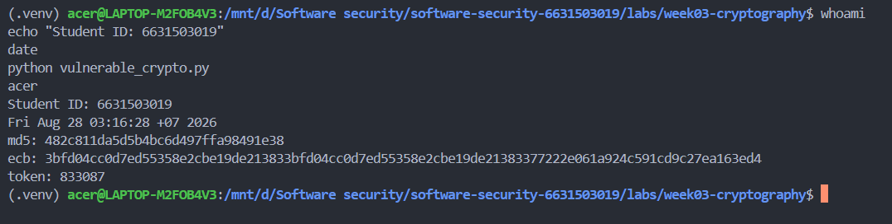
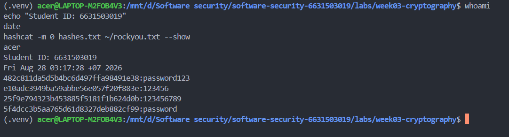
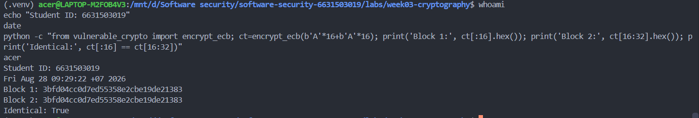
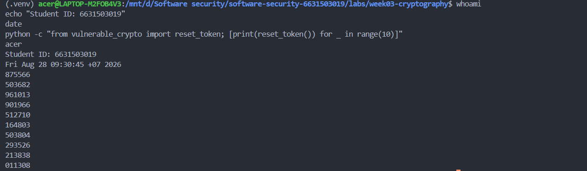
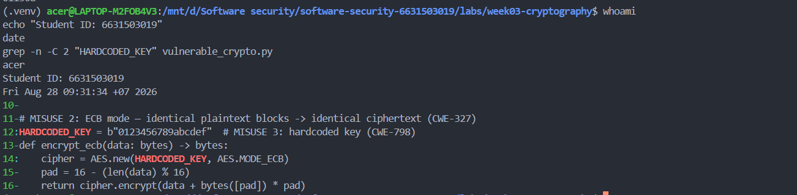
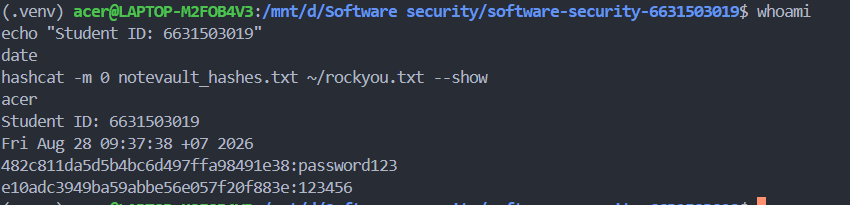
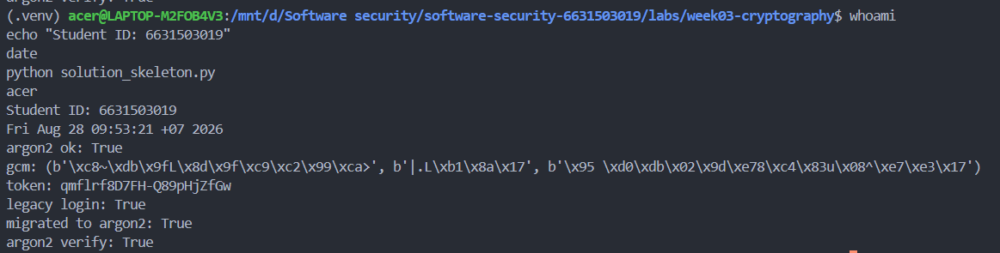
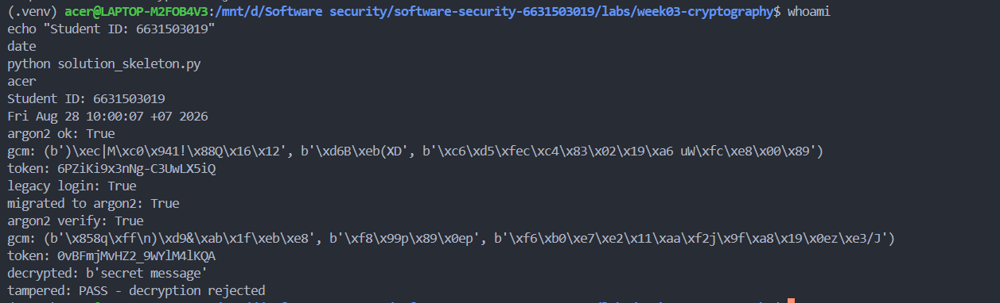
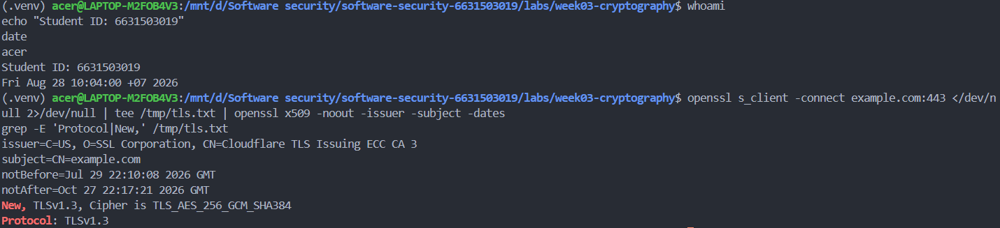
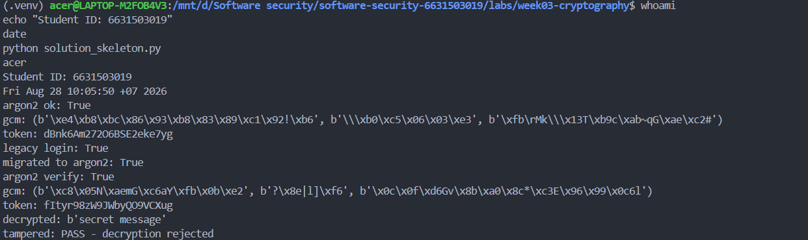

# Worksheet 3 — Cryptography Used Correctly (and Misused) (3 hrs)

> **Course:** Software Security (KOSEN69) · **Week 3**
> **Aligned to:** OWASP 2025 A04 Cryptographic Failures · CWE-327, CWE-916, CWE-330, CWE-798
> **Signature game:** "Capture the Hash" (recover plaintext from weak hashes)

> **Ethics note:** Crack only the hashes provided in `hashes.txt` on your own machine. Password-cracking against accounts or systems you don't own is illegal. Wordlists and recovered values stay inside the lab VM.

## Part 1 — Student Information
| Name | Student ID | Date | Group |
|---|---|---|---|
| Thiwakorn Boayairuksa| 6631503019 | 16/8/2569 | |

## Part 2 — Lecture Questions
Answer in your own words (2–4 sentences each).
1. Hashing is a one-way transformation mainly used for integrity checks and password verification, encryption is reversible with a key and is used to protect confidential data, and encoding changes data into another format for compatibility or transmission. Hashing is the wrong tool for storing data that must later be recovered, encryption is the wrong tool for verifying passwords, and encoding is the wrong tool for protecting sensitive information.
2. MD5 and SHA-1 are designed to be fast, so an attacker can try huge numbers of password guesses per second when cracking stolen password hashes. Passwords should instead be stored using a slow, password-specific hashing algorithm such as Argon2id, scrypt, or bcrypt, with a unique salt.
3. A salt is a random value added to a password before hashing, and it helps defeat precomputed attacks such as rainbow tables and makes identical passwords produce different hashes. Each password needs its own unique salt so that an attacker cannot efficiently reuse cracking work across multiple accounts with the same password.
4. AES-ECB encrypts identical plaintext blocks into identical ciphertext blocks, which can reveal patterns or structure in the original data even though the contents are encrypted. AES-GCM provides encryption plus authentication/integrity protection, allowing the receiver to detect if the ciphertext or associated data has been modified.
5. Python's random module is designed for simulations and general-purpose randomness, but its output is predictable enough that it should not be used for security-sensitive values. A CSPRNG such as Python's secrets module is designed to produce unpredictable values and should be used for passwords, session tokens, reset links, API tokens, nonces, and other security-sensitive random values.


## Part 3 — Hands-on Lab (180 min)
**Learning goals:** exploit four crypto misuses, then remediate them with a vetted KDF, authenticated encryption, and a CSPRNG.
**Prerequisites:** Docker (or local Python 3.12); `hashcat` or `john`; the `rockyou.txt` wordlist.

**Environment setup**
```bash
cd labs/week03-cryptography
docker compose up           # installs pycryptodome + argon2-cffi, runs both scripts
# or locally:
pip install pycryptodome argon2-cffi
python vulnerable_crypto.py # see the md5 hash, repeated ECB blocks, 6-digit token
```
Targets: `vulnerable_crypto.py` (the misuses), `hashes.txt` (four unsalted MD5s), and `solution_skeleton.py` (the fix).

**What to submit per task:** the command/payload run + a screenshot of the result + a 2–3 sentence mitigation.

**Task 0 — Onboarding (5 min)** · *Goal:* see the misuse output. *Steps:* run `python vulnerable_crypto.py`; note the md5 digest, the identical ECB ciphertext blocks, and the short token. *Deliverable:* screenshot of the program output.


**Task 1 — Capture the Hash (30 min)** · *Goal:* recover the passwords. *Steps:* strip the comment lines from `hashes.txt`, then run `hashcat -m 0 hashes.txt rockyou.txt` (or the `john --format=raw-md5` equivalent); recover all four plaintexts. *Deliverable:* screenshot of the cracked results (mask any real-looking value). Note in one line why unsalted MD5 fell so fast (CWE-916/327).
//Unsalted MD5 is fast and does not use a unique salt, allowing attackers to efficiently test large numbers of password guesses against stolen hashes. Passwords should instead be stored using a slow, salted password KDF such as Argon2id, which makes offline cracking substantially more difficult (CWE-916).
```sim
aes-modes
```

**Task 2 — ECB structure leak (20 min)** · *Goal:* prove ECB leaks. *Steps:* call `encrypt_ecb(b"A"*16 + b"A"*16)` from `vulnerable_crypto.py` and show the two 16-byte ciphertext blocks are identical; explain how this leaks plaintext structure (CWE-327). *Deliverable:* hex output highlighting the repeated block.
//I encrypted two identical 16-byte blocks using AES-ECB and got identical ciphertext blocks. This happens because ECB encrypts each block independently, so repeated plaintext patterns remain visible; AES-GCM with a random nonce should be used instead.

**Task 3 — Predictable token (15 min)** · *Goal:* show the reset token is guessable. *Steps:* call `reset_token()` repeatedly; argue why a 6-digit `random` token (10^6 space, non-CSPRNG) is brute-forceable (CWE-330). *Deliverable:* sample tokens + a one-line attack estimate.
//I generated several reset tokens and found that they are only 6 digits long. With only 1,000,000 possible values and a non-CSPRNG such as `random`, an attacker could potentially guess the token by brute force. Using `secrets` generates unpredictable security tokens.

**Task 4 — Hardcoded key (5 min)** · *Goal:* identify the key-management flaw. *Steps:* find `HARDCODED_KEY` in `vulnerable_crypto.py`; explain why shipping a key in source is CWE-798. *Deliverable:* the line + a 2-sentence mitigation.
//The encryption key is hardcoded in the source code, so anyone who obtains the source can potentially obtain the key and decrypt the data. The fix is to keep the key outside the source code, such as in an environment variable or secrets manager, and rotate it if it is exposed.

**Task 5 — Crack the project target's hashes (25 min)** · *Goal:* apply cracking to your term project. *Steps:* **NoteVault** stores unsalted MD5 password hashes; obtain them (via the app's `/admin` once you can reach it, or from its `seed()`), and crack them with `hashcat -m 0`. *Deliverable:* the recovered password(s) + note the CWE — record this finding for your project report (`project/REPORT-TEMPLATE.md` in the repo root).
//I found that NoteVault stores passwords as unsalted MD5 hashes in project/starter-app/app.py. I cracked the seeded hashes using Hashcat with a wordlist, demonstrating that fast unsalted MD5 is vulnerable to offline password cracking. This is CWE-916 (Use of Password Hash With Insufficient Computational Effort) and should be replaced with Argon2id.

**Task 6 — Password storage migration (25 min)** · *Goal:* fix it the way real apps do. *Steps:* write `store_password`/`verify_password` with **argon2id**, and a **rehash-on-login** path that upgrades a legacy MD5 record to argon2id the next time the user logs in. *Deliverable:* the code + a short note on why migration matters.
//import hashlib

def login_and_migrate(stored_hash: str, pw: str) -> tuple[bool, str]:
    # Already using Argon2id
    if stored_hash.startswith("$argon2"):
        return verify_password(stored_hash, pw), stored_hash

    # Legacy unsalted MD5
    if len(stored_hash) == 32:
        legacy_hash = hashlib.md5(pw.encode()).hexdigest()

        if legacy_hash == stored_hash:
            # Successful login -> migrate to Argon2id
            return True, store_password(pw)

    return False, stored_hash 

    Migration matters because existing users may still have passwords stored as weak MD5 hashes. Rehash-on-login lets the application upgrade a valid legacy MD5 password to Argon2id automatically, without forcing users to reset their passwords, while making future password verification much harder to crack offline.


**Task 7 — Authenticated encryption round-trip (20 min)** · *Goal:* use AEAD correctly. *Steps:* encrypt+decrypt a message with **AES-GCM** using a random 12-byte nonce and a key from an env var; then flip one ciphertext byte and show decryption **fails** (tag check). *Deliverable:* the round-trip output + the tampered-fails proof.
//I used AES-GCM with a random 12-byte nonce and an authentication tag to protect both confidentiality and integrity. The original message was successfully decrypted, but changing one byte of the ciphertext caused authentication to fail and the decryption was rejected.


**Task 8 — TLS in practice (15 min)** · *Goal:* read a real cert. *Steps:* run `openssl s_client -connect example.com:443 </dev/null 2>/dev/null | tee /tmp/tls.txt | openssl x509 -noout -issuer -subject -dates` for the cert summary, then `grep -E 'Protocol|New,' /tmp/tls.txt` for the negotiated TLS version (the version line is printed by `s_client`, not by `x509`, so the plain pipe would discard it); identify issuer, validity, and that TLS version. *Deliverable:* the cert summary + one line on what TLS protects that hashing/at-rest encryption does not.
//TLS protects data while it is being transmitted, including confidentiality, integrity, and server authentication, whereas hashing and at-rest encryption do not protect the communication channel.

**Task 9 — Defend / fix it (20 min)** · *Goal:* remediate using `solution_skeleton.py`. *Steps:* run `python solution_skeleton.py`; confirm `store_password`/`verify_password` use argon2id (auto-salted), `encrypt_gcm` uses a random 12-byte nonce + auth tag with a key from `ENC_KEY_HEX` env, and `reset_token` uses `secrets`. Map each fix to the CWE it closes. *Deliverable:* before/after table (misuse → fix → CWE closed) + screenshot of the fixed script running.
//The fixes replace fast unsalted MD5 with Argon2id, ECB with authenticated AES-GCM, predictable random tokens with a CSPRNG, and hardcoded keys with environment-based key management. These changes make password cracking harder, prevent ciphertext tampering, make reset tokens unpredictable, and prevent keys from being exposed directly in source code.

## Part 4 — Reflection
1. Weak password hashing (e.g., MD5/SHA-1) → CWE-916: Use of Password Hash With Insufficient Computational Effort → OWASP A04:2025 Cryptographic Failures.

Missing/weak salt → CWE-759: Use of a One-Way Hash without a Salt → OWASP A04:2025 Cryptographic Failures.

AES-ECB usage → CWE-327: Use of a Broken or Risky Cryptographic Algorithm → OWASP A04:2025 Cryptographic Failures.

Hardcoded cryptographic key → CWE-321: Use of Hard-coded Cryptographic Key → OWASP A04:2025 Cryptographic Failures. OWASP explicitly includes these types of weaknesses under A04.
2. The 2012 LinkedIn breach exposed millions of passwords that had been stored using weak SHA-1 hashing without proper salting. Replacing weak password hashing with a slow, salted password-hashing scheme such as Argon2id would have made offline password cracking substantially harder; this directly addresses the password-storage weaknesses targeted by A04.
3. The hardcoded cryptographic key is arguably the highest-risk issue because anyone who obtains the source code may obtain the key and potentially decrypt or forge protected data. Removing the key from source code, storing it in a secure secret/key-management system, and rotating compromised keys closes that immediate exposure; OWASP specifically warns against keys being checked into source repositories.
## Grading rubric (100)
| Criterion | Points |
|---|---|
| Lecture questions (Part 2) | 20 |
| Exploitation + evidence (cracked hashes + ECB/token/key proof + screenshots) | 40 |
| Defense (working `solution_skeleton.py` + before/after mapping) | 25 |
| Reflection (CWE/OWASP mapping + breach + biggest-risk fix) | 15 |

---

## Evidence & Integrity (required)

- **Identity proof:** every screenshot/diagram must show a terminal running `printf '%s | %s | ' "$(whoami)" '<YOUR-STUDENT-ID>'; date '+%F %T %Z'` **in the
  same image as the evidence**. When the evidence is a browser page, a DevTools panel or a
  rendered response, put that terminal **beside the browser and capture the whole screen** — a
  cropped window carries nothing that identifies you, and the lab's own output is
  byte-identical for the whole cohort *by design*, so the stamp is the only thing that makes
  the shot yours. Generic or borrowed evidence is not accepted.
- **Personalized flag (if this lab issues one):** ____________________
  *Flags are unique per student — submitting another student's flag is a violation. This blank is your personal record only; the flag itself is scored by submitting it in the **`ctf.zcr.ai`** challenge — the worksheet PDF is a separate submission, to **learn.zcr.ai/submit** (full guide: `SUBMISSION.md` in the repo root).*
- **Explain in your own words** *(graded on your reasoning, not copied text):*
  1. What did you do, and **why did the vulnerability work**?
  2. **Why does your fix actually stop it** — and what could still break it?

---

## 🤖 Audit the AI (required)

AI is a power tool you must **distrust** — you are graded on your *critique*, not the AI's answer.

1. Ask an AI assistant to exploit **or** fix this week's vulnerability. Paste its full answer.
2. **Find what's wrong or risky** in it — insecure code, a subtly incomplete fix, a hallucinated API/function/CVE, a missed edge case, or wrong reasoning. Quote the exact line(s).
3. Produce the **correct, verified** version yourself and explain in 2–3 sentences why the AI's output was insufficient.

> Disclose your AI use in the Part 1 table. This task counts toward your **Defense + Reflection** score.

---

## 🧠 Comprehension & Prompt (required)

**A. Explain in Plain English (EiPE).** In 2–3 sentences, in your own words, describe what this week's vulnerable code/endpoint actually *does* and *why it is exploitable* — explain the mechanism, don't dump jargon.

**B. Prompt Problem.** Write a **single prompt** that makes an AI produce a *correct, secure* fix for one finding. Run it: does the exploit now fail? If not, refine the prompt and try again. Submit the **final prompt + the verified result**.
*Graded on the prompt's precision and your verification — this trains problem decomposition and AI literacy (Denny et al. 2024).*
